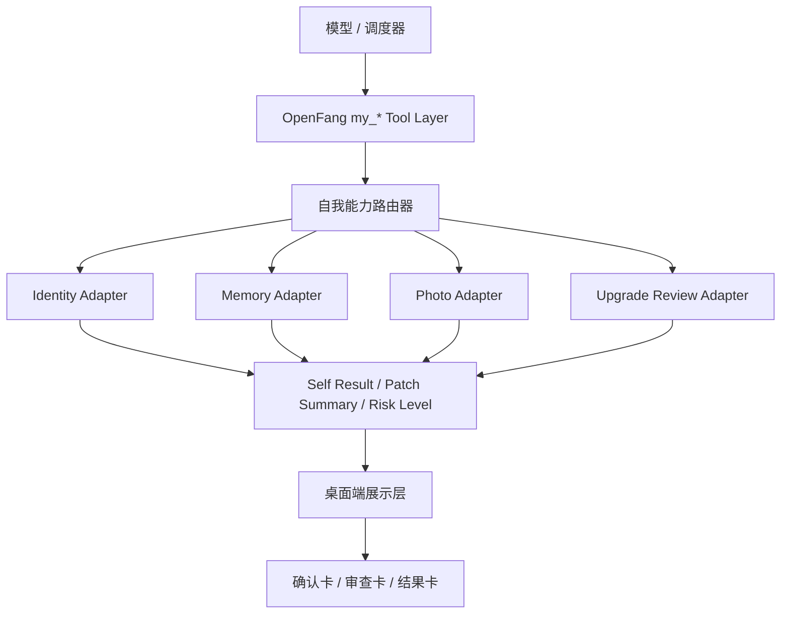

# 智能体自我管理升级系统重构计划（2026-03-24）

日期：2026-03-24  
状态：Plan Draft v1  
适用范围：`webot-app` 桌面端、`apps/service-rs` 管理层、`vendor/openfang` 运行时、智能体自我管理链路  
关联文档：  
- `docs/agent-self-management-upgrade-system-2026-03-22.md`
- `docs/ui-skill-component-skill-runtime-refactor-2026-03-24.md`
- `../docs/桌面端能力层重构方案.md`

---

## 1. 计划目标

本文不是再次讨论“要不要做自我管理系统”，而是把现有设计收敛成一份**可执行的工程计划**。

这份计划不是上位架构文档，本计划默认服从：

1. `ui-skill-component-skill-runtime-refactor-2026-03-24.md`

也就是说：

1. 上位架构先定义 `OpenFang Tool Layer -> Capability Adapter Layer -> Presentable Result Layer -> Channel Renderer Layer`
2. 本计划只负责把 `my_*` 系列能力如何并入这套架构落成实施路径

本次重构的目标有四个：

1. 把“自我管理能力”从公共能力中彻底分离，形成稳定的 `my_*` 工具域。
2. 把自我照片、自我身份、自我记忆、自我升级审查接入到底层 runtime，而不是继续依赖脏提示词和前端特判。
3. 让桌面端先完成能力层收敛，避免 `UI_JSON / ComponentInvokeAction / 自我管理动作 / 通用工具` 继续混在一起。
4. 为后续周期审查、自动小修、用户确认式升级打下可审计的基础。

一句话概括：

**先把“自我能力”变成底层稳定协议，再把桌面端 UI 退回成展示与交互入口。**

---

## 2. 本次重构范围

### 2.1 本次必须覆盖

1. 自我身份文件 patch 链路
2. 自我长期记忆 patch 链路
3. 自我照片生成与编辑链路
4. 自我升级审查链路
5. 桌面端自我管理相关提示词注入收敛
6. 桌面端自我管理结果展示收敛

### 2.2 本次暂不覆盖

1. WhatsApp / Telegram / Discord / 邮件 的最终输出协议
2. 完整的后台异步作业中心
3. 全自动高风险身份重写
4. 复杂自治状态机
5. 独立 Self State Center 数据库

---

## 3. 当前问题归纳

结合现有代码和 2026-03-22 方案，当前主要问题如下：

1. “修改自己”和“修改一般对象”虽然已有概念分离，但整体链路还没有完全收敛到统一 `my_*` 工具域。
2. 桌面端大量自我管理行为仍依赖系统提示词、UI 卡片动作和前端特判。
3. 自我照片链路与通用图片链路交叉，仍容易出现“该复用现有身份锚点却重新生成”的问题。
4. 自我身份修改缺少统一的风险分级和变更日志模型。
5. 自我升级审查与记忆总结系统之间还没有形成稳定闭环。
6. 前端对工具结果的理解仍偏事件流驱动，没有统一的中立结果协议。

---

## 4. 重构原则

### 4.1 工具域优先

以下能力必须优先作为底层语义工具存在：

1. `my_identity_patch`
2. `my_memory_patch`
3. `my_photo_generate`
4. `my_photo_edit`
5. `my_upgrade_review`
6. `my_upgrade_apply`

桌面端卡片、组件、确认动作，只能作为这些工具的输入入口或展示出口。

### 4.2 通用工具域与个人边界工具域并存

本次不采用“只有一套工具，再靠提示词判断是不是自己”的做法。

而是采用：

1. **通用工具域**
2. **个人边界工具域**

二者共享底层 capability，但边界不同。

### 4.3 自我能力与公共能力彻底分离

保留公共工具：

1. `image_generate`
2. `image_edit`
3. 公共文件读写
4. 公共记忆查询

自我链路一律不再通过公共工具软约束来保证身份安全。

### 4.4 低风险自动化，高风险确认化

本次重构必须把风险分级落实到协议层，而不是只写在文档里。

### 4.5 结果先统一，再谈 UI

自我管理链路产生的结果，必须先统一为中立结果对象，再映射到：

1. 普通文本说明
2. 桌面端确认卡
3. 桌面端结果卡
4. 后续可扩展的渠道渲染器

---

## 5. 通用技能与个人边界工具定义

### 5.1 通用技能

这里的“通用技能”指的是：

1. 可分配给多个智能体
2. 面向一般对象
3. 不自带“当前智能体自己”的权限语义
4. 可以通过组件 skill、provider、MCP、runtime tool 实现

通用技能负责：

1. 提供一般能力
2. 提供展示规则
3. 提供组件化交互入口

但它们不负责：

1. 决定“是不是当前智能体自己”
2. 决定“是否可以改自己的核心身份”
3. 决定“是否允许替换自己的脸”

### 5.2 个人边界工具

这里的“个人边界工具”指的是：

1. 只能作用于当前智能体自己
2. 由 runtime 强制注入边界
3. 默认带审计、确认、风险分级
4. 可以复用通用能力实现，但不能退化成通用工具

个人边界工具负责：

1. 访问自己的身份文件
2. 访问自己的长期记忆
3. 访问自己的头像 / 立绘 / 自有照片体系
4. 执行自己的升级审查与应用

### 5.3 推荐边界模型

建议后续统一采用：

1. `capability`
2. `scope`
3. `risk_level`

示例：

1. `image_generate`
   - `capability=generate.image`
   - `scope=generic`
2. `my_photo_generate`
   - `capability=generate.image`
   - `scope=self`
3. `image_edit`
   - `capability=edit.image`
   - `scope=generic`
4. `my_photo_edit`
   - `capability=edit.image`
   - `scope=self`
5. `my_memory_patch`
   - `capability=patch.memory`
   - `scope=self`
6. `my_identity_patch`
   - `capability=patch.identity`
   - `scope=self`
7. `my_upgrade_review`
   - `capability=review.upgrade`
   - `scope=self`
8. `my_upgrade_apply`
   - `capability=apply.upgrade`
   - `scope=self`

### 5.4 关键结论

1. 个人边界不是 skill 层概念，而是 tool/runtime 层概念。
2. 通用 skill 可以被个人边界工具复用，但不能替代个人边界工具。
3. `UI skill` 与 `组件 skill` 都不应直接持有“我只能改自己”的规则。
4. “自己是谁”必须由 runtime 注入，而不是由模型猜。

---

## 6. 目标架构

### 6.1 核心分层

1. `my_* Tool Layer`
   - 作为模型唯一稳定入口
2. `Self Capability Router`
   - 负责参数归一、权限边界、风险判定
3. `Self Result Layer`
   - 统一输出 patch 结果、媒体结果、确认需求、审查报告
4. `Desktop Presentation Layer`
   - 再把结果转成桌面 UI

---

## 7. 分阶段计划

## 7.1 Phase 0：基线收敛

目标：

1. 先把当前自我管理链路摸清楚
2. 收敛术语、结果模型、边界约束

任务：

1. 盘点现有 `my_photo_generate` / `my_photo_edit` 已落地逻辑
2. 盘点桌面端 `AgentSelfAppearanceAction`、`AgentManagementConfirmCard`、相关 prompt 注入点
3. 盘点身份文件写入链路、工作区绑定链路、头像立绘导入链路
4. 盘点记忆系统已有 patch / summary / recall 接口
5. 明确哪些逻辑在 `vendor/openfang`，哪些在 `apps/service-rs`，哪些在前端

交付物：

1. 一份链路清单
2. 一份结果模型草案
3. 一份风险分级表

完成标准：

1. 能明确指出每类自我管理动作目前在哪一层执行
2. 不再新增新的提示词特判来补洞

## 7.2 Phase 1：自我工具域定型

目标：

把自我管理主协议固定为 `my_*` 工具域，并与上位架构中的 capability / scope 模型对齐。

任务：

1. 为以下工具定义稳定输入输出 schema：
   - `my_identity_patch`
   - `my_memory_patch`
   - `my_photo_generate`
   - `my_photo_edit`
   - `my_upgrade_review`
   - `my_upgrade_apply`
2. 给每个工具明确：
   - 用途
   - 可操作对象
   - capability
   - scope
   - 默认风险级别
   - 是否允许自动执行
3. 把“必须确认”和“可自动执行”下沉到 tool schema / handler 约束，而不是只靠 prompt 说教

交付物：

1. 工具输入输出约定文档
2. 风险分级约定
3. 统一错误码与拒绝原因约定

完成标准：

1. 模型不需要通过公共工具绕路完成自我修改
2. 自我管理能力不再依赖“你只能改自己”这种软提示词才能成立

## 7.3 Phase 2：身份与记忆链路落地

目标：

先把文字类自我管理能力打稳。

任务：

1. 落地 `my_memory_patch`
   - 增加
   - 修正
   - 失效标记
   - 升级结论写入
2. 落地 `my_identity_patch`
   - patch 模式
   - replace 模式限制
   - 变更摘要
   - 原因记录
3. 建立身份文件风险分级
   - `MEMORY.md` / `USER.md` 低风险
   - `SOUL.md` / `IDENTITY.md` 中风险
   - `SYSTEM_PROMPT` 高风险
4. 接入变更日志
   - 记录发起时间
   - 记录来源
   - 记录是否经过确认
   - 记录应用结果

交付物：

1. 底层 handler
2. 变更日志格式
3. 桌面端最小结果卡 / 审计展示

完成标准：

1. 自我记忆修改不再依赖前端直接 patch 文件
2. 自我身份修改有统一日志和风险边界

## 7.4 Phase 3：自我照片链路收敛

目标：

把“自己的照片”和“公共图片”彻底拆开。

任务：

1. 重新核对 `my_photo_generate` / `my_photo_edit` 与 `image_generate` / `image_edit` 的边界
2. 明确它们共享 `generate.image` / `edit.image` capability，但不能共享同一套边界策略
3. 明确身份锚点优先级
   - 当前头像
   - 当前立绘
   - 最近自有照片
4. 统一输入资源解析
   - 工作区相对路径
   - 会话可访问 URL
   - 管理接口 URL
   - 数据 URL
5. 统一输出结果
   - 新头像候选
   - 新立绘候选
   - 自己的换装照
   - 局部修改结果
6. 明确哪些照片修改可自动执行，哪些必须确认

交付物：

1. 自我照片输入输出规范
2. 身份锚点恢复规则
3. 桌面端统一展示与采用动作

完成标准：

1. 用户说“给你换衣服”时，默认稳定走自我照片链路
2. 用户未确认时，不允许把新脸替换为当前身份锚点

## 7.5 Phase 4：升级审查闭环

目标：

把“总结 -> 建议 -> 应用”这条主链路真正建立起来。

任务：

1. 落地 `my_upgrade_review`
   - 汇总最近会话
   - 汇总长期记忆
   - 汇总用户反馈
   - 输出保留项、问题项、自动修复项、需确认项
2. 落地 `my_upgrade_apply`
   - 只执行低风险项
   - 高风险项生成确认摘要
3. 与总结系统打通
   - `turn_review`
   - `topic_review`
   - `period_review`
   - `upgrade_review`
4. 形成升级历史记录

交付物：

1. 升级审查报告结构
2. 升级应用结构
3. 升级历史日志

完成标准：

1. 自我完善以总结为入口，而不是临时起意修改
2. 能回溯每次升级建议从何而来

## 7.6 Phase 5：桌面端提示词与 UI 收口

目标：

把桌面端的自我管理表现层从主逻辑里剥离出来。

任务：

1. 精简 `agent-client.ts` 中与自我管理相关的强提示词注入
2. 保留必要决策规则：
   - 什么时候走 `my_photo_edit`
   - 什么时候必须确认
   - 什么时候只能做 patch
3. 把自我管理相关展示统一成有限几种卡片：
   - 自我外观动作卡
   - 身份变更确认卡
   - 升级审查卡
   - 升级结果卡
4. 减少前端针对自我管理的散落特判

交付物：

1. 精简后的提示词策略
2. 统一桌面端卡片模型
3. 旧特判清理清单

完成标准：

1. 桌面端只负责展示和确认
2. 自我管理执行逻辑不再依赖大量前端副作用

---

## 8. 任务拆解建议

### 8.1 运行时层

责任区域：

1. `vendor/openfang/crates/openfang-runtime`
2. `vendor/openfang/crates/openfang-kernel`

主要任务：

1. 定义 `my_*` tool schema
2. 实现 handler
3. 接入风险判定
4. 接入结果对象

### 8.2 服务层

责任区域：

1. `apps/service-rs/src/routes.rs`
2. `apps/service-rs/src/component_center.rs`
3. 管理接口与资产处理逻辑

主要任务：

1. 统一资产引用解析
2. 自我身份文件写入接口收口
3. 自我照片采用接口收口
4. 变更日志与审计接口

### 8.3 前端层

责任区域：

1. `apps/frontend/src/services/agent-client.ts`
2. `apps/frontend/src/pages/ChatPage.tsx`
3. 自我管理卡片组件
4. 结果展示映射层

主要任务：

1. 精简提示词注入
2. 收敛 UI 动作
3. 建立统一展示映射
4. 减少自我管理专用特判

---

## 9. 验收标准

本次计划的最终验收不以“功能数量”衡量，而以是否完成以下收敛为准。

### 8.1 能力层验收

1. 模型可以明确区分公共能力与自我能力
2. 自我管理不需要绕用公共工具
3. 关键自我能力有稳定 schema
4. 自我能力与通用能力已能映射到统一 capability / scope 模型

### 9.2 安全边界验收

1. 高风险身份修改默认要求确认
2. 自我照片换脸默认不允许自动生效
3. 核心身份文件不会被无理由整体重写

### 9.3 桌面端验收

1. 自我管理相关提示词明显减少
2. 自我管理结果展示收敛为少量稳定卡片
3. 前端不再承担主要执行逻辑

### 9.4 审计验收

1. 每次自我升级都有原因
2. 每次落地都有摘要
3. 每次高风险变更都有确认记录或拒绝记录

---

## 10. 风险与应对

### 9.1 风险：继续把能力逻辑塞进提示词

问题：

1. 短期修得快
2. 长期越来越脏

应对：

1. 本次原则上不再用大段提示词掩盖能力层缺口
2. 先补 tool schema，再补 UI

### 9.2 风险：桌面端动作仍然绕过底层

问题：

1. 表面能用
2. 实际不可维护

应对：

1. 所有核心自我动作都要能在 runtime 层独立成立
2. 前端动作只做触发和确认

### 9.3 风险：一次性做太大

问题：

1. 改动面广
2. 容易半途失控

应对：

1. 先做文字链路
2. 再做照片链路
3. 最后做升级审查闭环

---

## 11. 推荐落地顺序

如果按工程投入与收益比排序，建议按以下顺序推进：

1. `my_memory_patch`
2. `my_identity_patch`
3. 自我管理统一结果模型
4. `my_photo_generate`
5. `my_photo_edit`
6. `my_upgrade_review`
7. `my_upgrade_apply`
8. 桌面端提示词收口
9. 桌面端卡片与审计视图收口

---

## 12. 本计划的实施结论

本次重构不应继续理解为“再给桌面端多加几张确认卡”，而应理解为：

1. 把自我管理从提示词习惯升级为底层协议
2. 把自我升级从零散动作升级为可审计闭环
3. 把桌面端从执行中心降级为展示与交互中心

只有做到这三点，`agent-self-management-upgrade-system-2026-03-22.md` 才算真正从设计稿进入工程实现阶段。
