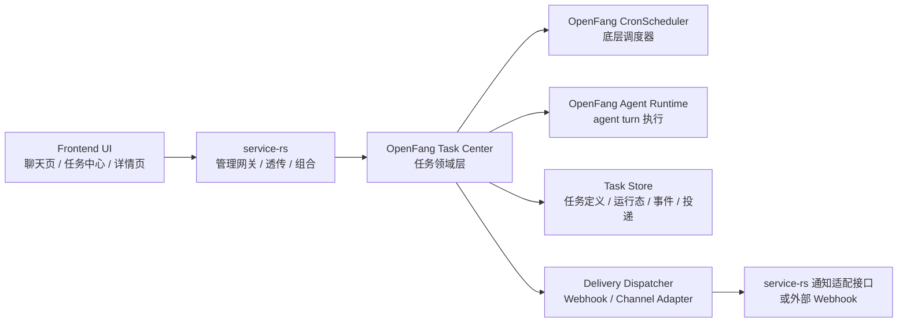
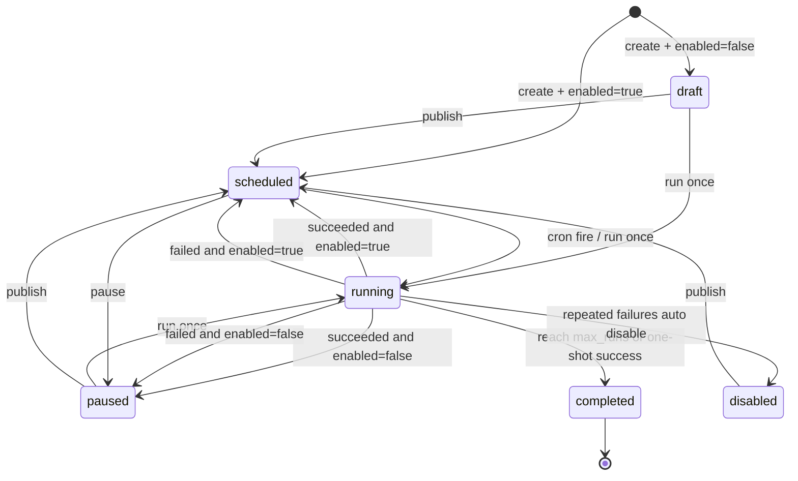
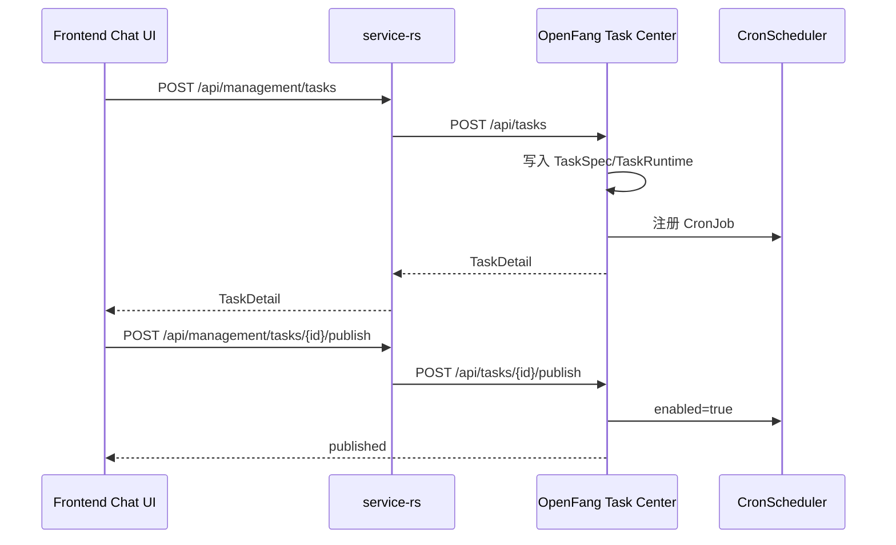
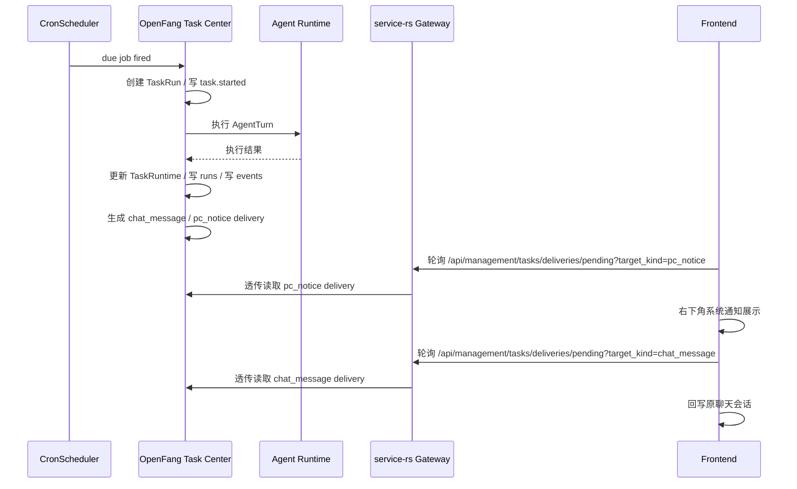

# 任务调度中心一体化架构设计

日期：2026-03-24

## 1. 背景与问题

当前任务系统已经形成三套状态源并行的局面：

1. `OpenFang cron` 保存任务定义、运行状态、执行日志。
2. `apps/service-rs` 额外维护任务绑定信息、投递回执和通知辅助状态。
3. `apps/frontend` 继续用 `localStorage` 维护任务元数据、最终总结和补充展示状态。

这直接带来以下问题：

- 聊天创建任务与手工创建任务的语义不一致。
- “创建”“发布”“立即执行一次”三个动作被混在一起。
- 前端通过 watcher 推断任务进度、最终完成和通知时机，导致页面刷新、挂载顺序、轮询失败都会影响业务正确性。
- 底层 OpenFang 已经具备 cron 调度和运行态记录能力，但业务任务语义没有回归内核，导致前端和网关层被迫补逻辑。
- 异步上报与异步通知依赖前端生产者，不能保证稳定、可恢复、可重放。

本设计的目标是重建一套以 OpenFang 为核心的“任务调度中心”架构，让任务能力真正回归内核，`service-rs` 退回薄网关，前端仅负责 UI 和交互。

## 1.1 当前 V1 落地状态

截至 2026-03-24，以下链路已经落地：

1. `OpenFang` 已新增受管任务模型、SQLite 存储、`/api/tasks*` 原生接口，并将 cron fire 接入受管任务执行。
2. `service-rs` 已新增 `/api/management/tasks*` 透传接口。
3. `service-rs` 已统一提供 `/api/management/tasks/deliveries/*` 作为 delivery 消费入口，聊天页与 PC 通知页都走管理网关主路径。
4. 前端任务中心页已切到 `/api/management/tasks*`，并支持 `publish`、`pause`、`run-once` 三个动作。
5. 前端全局 `TaskDeliveryWatcher` 已从主布局移除，PC 通知改为只消费型 `TaskNoticeBridge`。
6. 聊天任务已支持最小槽位补全规则：`目标 + 频率 + 汇报条件` 未齐时先追问，齐全后再输出任务卡片草案。

以下能力仍处于 V1 兼容或过渡状态：

1. 前端仍保留少量 `localStorage` 任务绑定/展示缓存，用于聊天卡片映射、渲染恢复和过渡兼容，但不再作为任务真相源。
2. 聊天任务的远端会话绑定已下沉到 OpenFang 原生 `TaskSpec.binding`，前端不再额外补写任务元数据。
3. PC 通知虽然由 OpenFang 生成 `pc_notice` delivery，但桌面右下角弹窗仍需要前端在线消费。
4. 外部 webhook 类型已在模型中预留，但当前 V1 执行链路实际稳定落地的是 `chat_message` 与 `pc_notice` 两类 delivery。

## 2. 设计目标与非目标

### 2.1 设计目标

1. OpenFang 成为任务系统唯一状态源。
2. 任务的创建、发布、调度、执行、完成、回执、通知全部由 OpenFang 驱动。
3. `service-rs` 只做 API 透传、协议适配、少量组合视图，不复制任务业务状态。
4. 前端不再生成任务回执，不再推断任务完成，不再维护任务最终状态缓存。
5. 聊天任务与手工任务最终统一映射为同一种底层任务模型。
6. 为后续支持多通知渠道、任务事件流、运行回放和任务审计预留标准化接口。

### 2.2 非目标

1. 本文档不要求本轮一步到位删除全部兼容层；允许在 V1 期间保留只读/只绑定型兼容桥接。
2. 本文档不要求立刻重写 OpenFang 的原生 `CronScheduler`。
3. 本文档不覆盖通用 Workflow、A2A、审批流等其他业务中心的重构。

## 3. 核心原则

1. OpenFang 是唯一业务状态源。
2. `service-rs` 是网关，不是第二任务引擎。
3. 前端只消费状态，不生产状态。
4. 任务中心对外暴露业务任务模型，不直接暴露裸 `CronJob`。
5. 所有异步执行必须具备可恢复、可查询、可审计能力。
6. 所有通知的“生成时机”和“投递状态源”必须由后端掌握；V1 的 PC 桌面通知允许由前端消费服务端 delivery 后显示。

## 4. 总体架构

### 4.1 分层职责

#### OpenFang

- 持有任务定义与运行态。
- 负责调度、执行、状态推进、事件生成、通知派发。
- 负责任务绑定、最终总结、回执、投递重试、运行历史。

#### service-rs

- 透传 OpenFang 任务中心接口。
- 保留统一鉴权、错误透传、协议适配、聚合视图能力。
- 作为通知适配器时，仅负责发送，不保存任务业务状态。

#### frontend

- 提供聊天创建、手工创建、任务列表、任务详情、运行记录、事件时间线 UI。
- 只请求任务中心 API，不再通过本地 watcher 自行推断状态。
- 所有页面以服务端返回的任务详情、运行记录、事件流为准。
- V1 允许保留少量本地渲染缓存与聊天绑定缓存，但这些缓存不能成为业务真相源。

## 5. OpenFang 任务调度中心设计

### 5.1 设计定位

任务调度中心是 OpenFang 内部位于 `CronScheduler` 之上的业务层。`CronScheduler` 继续负责“何时触发”，任务中心负责“触发后如何执行业务任务、如何管理生命周期、如何产出事件和通知”。

### 5.2 核心对象模型

本节分为两层：

1. “目标字段”表示长期演进方向。
2. “V1 实际落地”表示当前代码中已经稳定存在的字段与枚举，后续实现必须优先遵循这一层，避免文档与代码分叉。

#### TaskSpec

任务的业务定义，面向用户与 UI。

建议字段：

- `id`
- `agent_id`
- `name`
- `source_type`
  - `chat`
  - `manual`
  - `custom`
- `source_ref`
- `binding`
  - 来源会话
  - 来源消息
  - 创建者
  - 执行者
  - 汇报者
- `schedule`
  - `at`
  - `every`
  - `cron`
- `action`
  - `agent_turn`
  - `system_event`
- `delivery`
  - `none`
  - `webhook`
  - `pc_notice`
  - `chat_message`
- `enabled`
- `created_at`
- `updated_at`

#### 5.2.1 V1 实际落地字段

当前代码中的 OpenFang 受管任务结构，以 `ManagedTask*` 为准：

- `ManagedTaskSpec`
  - `id`
  - `agent_id`
  - `name`
  - `source_type`
    - `chat`
    - `manual`
    - `custom`
  - `source_ref`
  - `report_condition`
  - `summary_style`
  - `enabled`
  - `schedule`
    - `kind`
    - `expr`
    - `tz`
    - `at`
    - `every_secs`
  - `action`
    - `job_type`
    - `prompt`
    - `command`
    - `session_target`
  - `delivery`
    - `mode`
    - `channel`
    - `to`
    - `best_effort`
    - `final_summary_prompt`
    - `notify_on_final`
  - `max_runs`
  - `binding`
    - `origin_conversation_type`
    - `origin_conversation_id`
    - `origin_chat_session_id`
    - `origin_message_id`
    - `creator_participant_id`
    - `creator_participant_name`
    - `executor_agent_id`
    - `executor_agent_name`
    - `report_actor_agent_id`
    - `report_actor_agent_name`
  - `cron_job_id`
  - `created_at`
  - `updated_at`
- `ManagedTaskRuntime`
  - `state`
  - `next_run`
  - `last_run`
  - `last_status`
  - `last_output`
  - `run_count`
  - `consecutive_errors`
  - `latest_summary`
  - `last_error`
  - `completed_at`
  - `disabled_reason`
- `ManagedTaskStatus`
  - `idle`
  - `running`
  - `ok`
  - `error`
  - `cancelled`
- `ManagedTaskRunTriggerType`
  - `schedule`
  - `manual`
- `ManagedTaskEventType`
  - `created`
  - `published`
  - `paused`
  - `started`
  - `progress`
  - `anomaly`
  - `succeeded`
  - `failed`
  - `completed`
  - `delivery_pending`
  - `delivery_sent`
  - `delivery_failed`
- `ManagedTaskDeliveryTargetKind`
  - `chat_message`
  - `pc_notice`
  - `webhook`
- `ManagedTaskDeliveryStatus`
  - `pending`
  - `reported`
  - `acknowledged`
  - `failed`

V1 当前真实写入最常见的事件类型是：

1. `created`
2. `published`
3. `paused`
4. `started`
5. `anomaly`
6. `succeeded`
7. `failed`
8. `completed`

其中 `progress`、`delivery_pending`、`delivery_sent`、`delivery_failed` 目前已在枚举层预留，但还不是 V1 主执行链中的稳定产物。

#### TaskRuntime

任务当前运行态。

建议字段：

- `task_id`
- `state`
  - `draft`
  - `scheduled`
  - `running`
  - `paused`
  - `completed`
  - `failed`
  - `disabled`
- `run_count`
- `success_count`
- `failure_count`
- `consecutive_errors`
- `last_run_at`
- `next_run_at`
- `last_status`
- `last_output`
- `last_error`
- `active_run_id`
- `completed_at`
- `disabled_reason`

#### TaskRun

任务每次执行的运行记录。

建议字段：

- `run_id`
- `task_id`
- `run_no`
- `triggered_at`
- `started_at`
- `finished_at`
- `status`
  - `running`
  - `succeeded`
  - `failed`
  - `timeout`
  - `cancelled`
- `trigger_type`
  - `schedule`
  - `manual`
  - `replay`
- `input_message`
- `output_summary`
- `output_text`
- `error_text`
- `usage`
- `trace_id`

#### TaskEvent

面向 UI、审计和通知的统一事件流。

建议字段：

- `event_id`
- `task_id`
- `run_id`
- `event_type`
  - `task.created`
  - `task.published`
  - `task.paused`
  - `task.started`
  - `task.progress`
  - `task.anomaly`
  - `task.succeeded`
  - `task.failed`
  - `task.completed`
  - `task.delivery.pending`
  - `task.delivery.sent`
  - `task.delivery.failed`
- `occurred_at`
- `summary`
- `payload`

#### TaskDeliveryAttempt

任务通知或回执的投递记录。

建议字段：

- `delivery_id`
- `task_id`
- `run_id`
- `event_id`
- `delivery_type`
  - `progress_notice`
  - `final_notice`
  - `chat_report`
  - `webhook`
- `channel`
- `target`
- `status`
  - `pending`
  - `sent`
  - `failed`
  - `acknowledged`
- `attempt_count`
- `last_error`
- `next_retry_at`
- `created_at`
- `updated_at`

### 5.3 状态机

### 5.4 执行流程

#### 任务创建

1. UI 提交业务任务定义到 `service-rs`。
2. `service-rs` 透传给 OpenFang 任务中心。
3. OpenFang 写入 `TaskSpec`、初始化 `TaskRuntime`。
4. 任务中心将调度信息映射为底层 `CronJob`。
5. 返回统一 `TaskDetail` 给前端。

#### 定时触发

1. `CronScheduler` 在 tick 中发现 due job。
2. 任务中心接管触发，将其转为一次 `TaskRun`。
3. V1 当前至少写入 `started` 事件，再根据执行结果补写 `succeeded` / `failed` / `anomaly` / `completed`。
4. 对 `AgentTurn` 调用 OpenFang agent runtime 执行。
5. 写入运行结果、更新 `TaskRuntime`。
6. 根据策略决定：
   - 是否继续下一轮
   - 是否标记完成
   - 是否生成最终总结
   - 是否发通知

#### 手工立即执行

“立即执行一次”必须是单独动作，不等于 `enabled=true`。

1. UI 调用 `POST /tasks/{id}/run-once`。
2. OpenFang 立即创建一条 `TaskRun`。
3. 本次执行不修改定时任务定义，只影响运行态和事件流。

### 5.5 最终总结与通知策略

最终总结不再由前端 watcher 生成，而由任务中心在以下条件下生成：

- one-shot 成功完成
- recurring 达到 `max_runs`
- recurring 被策略判定为终结状态
- 明确要求失败时也生成收尾总结

V1 当前真实行为补充：

1. 完成总结当前直接复用本次成功执行结果的摘要，不额外再跑一轮独立 LLM 总结器。
2. `latest_summary`、`completed` 事件摘要、最终 `chat_message` / `pc_notice` delivery 正文当前保持同源。
3. 异常上报当前分两类：
   - 执行失败，直接产出 `failed` 事件和异常 delivery
   - 执行成功但输出命中 `告警状态：触发`，产出 `anomaly` 事件和异常 delivery
4. 失败达到阈值时当前会自动进入 `disabled`，但默认不会额外生成“失败收尾总结”消息。

### 5.5.1 异常任务处理策略

V1 建议把异常处理策略明确为以下闭环：

1. “执行失败”和“业务异常”必须区分：
   - 执行失败：Agent 调用报错、超时、shell 执行失败，写 `failed` 事件
   - 业务异常：任务执行成功，但结果命中告警条件，写 `anomaly` 事件
2. “执行失败”必须累加 `consecutive_errors`；“业务异常”不计入连续失败阈值。
3. 连续失败达到阈值时，任务自动进入 `disabled`，当前 V1 阈值为 5 次。
4. 进入 `disabled` 后必须停止后续自动调度，并清空 `next_run`。
5. `disabled` 的恢复入口当前统一走 `publish`；后续若要支持“恢复但保留失败计数”或“重置后恢复”，需要单独设计。
6. V1 默认通知范围：
   - `anomaly`：生成 `chat_message` 与 `pc_notice`
   - `failed`：生成 `chat_message` 与 `pc_notice`
   - 普通 `progress`：默认不生成用户可见通知
   - `completed`：生成 `chat_message` 与 `pc_notice`
7. 聊天页展示时：
   - `anomaly` / `failed` 更新任务卡片时间线，并写入 `errorSummary`
   - `completed` 更新 `finalSummaryText`
   - 普通进度仅更新卡片，不默认插入聊天消息，避免刷屏

通知策略由任务中心统一执行：

1. 根据 `TaskPolicy` 判断是否需要进度通知、异常通知、最终通知。
2. 生成 `TaskDeliveryAttempt`。
3. 调用 delivery dispatcher。
4. 记录投递结果，失败时进入重试队列。

### 5.6 Delivery 设计

#### 推荐方案

OpenFang 统一作为通知发起者，`service-rs` 只充当渠道适配器。

具体落地：

- `CronDelivery::Webhook` 保留并扩展为通用投递能力。
- 新增任务中心自己的 `DeliveryDispatcher`，长期支持：
  - `service_gateway`
  - `webhook`
  - `none`
- 对于 Telegram、Discord、Feishu、QQBot、Email 等具体渠道，不直接散落在前端，而是通过 OpenFang 调用统一通知出口。

#### V1 当前实现边界

当前已稳定打通的 delivery 目标只有：

1. `chat_message`
2. `pc_notice`

其中：

1. `chat_message` 由 OpenFang 产出 delivery，前端聊天页通过兼容消费接口读取并回写到原本地会话。
2. `pc_notice` 由 OpenFang 产出 delivery，前端全局 `TaskNoticeBridge` 消费后调用系统 `Notification`。
3. `webhook` 目前属于模型预留项，文档可以继续保留设计，但必须明确“尚未作为 V1 主链交付”。

#### V1 delivery 状态流转

当前 V1 的 delivery 状态流转建议按下表理解：

| 状态 | 写入方 | 触发时机 | 当前实际用途 |
| --- | --- | --- | --- |
| `pending` | OpenFang Task Center | 生成 `chat_message` / `pc_notice` delivery 时 | 待前端消费者拉取 |
| `acknowledged` | 前端消费者 | 已成功展示 PC 通知，或已成功回写聊天消息后 | 表示已消费完成 |
| `reported` | 兼容预留 | 旧链路或后续外部通道可用于“已上报但待用户确认” | 当前 V1 主链基本未使用 |
| `failed` | 前端消费者或后续渠道发送器 | 消费失败或发送失败时 | 为后续重试和审计保留 |

V1 当前还需要明确两条边界：

1. OpenFang 当前只负责生产 delivery 与保存状态，不主动把 `pending` 推进为 `reported`。
2. `delivered_at` 当前在 delivery 被置为非 `pending` 状态时统一写入，因此它更接近“被消费/被确认时间”，而不是严格意义上的“渠道送达时间”。

#### 为什么不继续走前端 watcher

- 前端不稳定，受页面是否打开影响。
- 不能保证通知一定发送。
- 刷新页面无法安全恢复队列。
- 无法在服务端统一做重试、限流、审计。

### 5.7 持久化设计

当前 V1 已在 OpenFang 内落地任务中心 SQLite 存储，不再复用前端 `localStorage` 或 `service-rs` SQLite 作为业务主存。

最低需要持久化以下集合：

- `task_specs`
- `task_runtimes`
- `task_runs`
- `task_events`
- `task_delivery_attempts`

当前实际分层是：

1. 底层 `CronScheduler` 仍可继续维护自己的调度持久化。
2. 任务中心业务数据已经统一写入 SQLite。

后续演进方向：

- 继续保持任务中心业务数据以 SQLite 为主。
- 视后续改造深度，再决定是否把底层调度持久层也进一步收敛到同一数据访问层。

### 5.8 OpenFang 内部模块落点

当前 V1 实际代码主要落在以下位置：

- `crates/openfang-types/src/tasks.rs`
- `crates/openfang-memory/src/task_center.rs`
- `crates/openfang-memory/src/migration.rs`
- `crates/openfang-memory/src/substrate.rs`
- `crates/openfang-kernel/src/kernel.rs`
- `crates/openfang-api/src/types.rs`
- `crates/openfang-api/src/routes.rs`
- `crates/openfang-api/src/server.rs`

长期如果任务中心复杂度继续上升，可以再考虑抽离独立 `openfang-task-center` crate；但这不是当前 V1 的真实代码组织方式。

任务中心对 `CronScheduler` 的依赖关系：

- `TaskCenterService` 持有 `CronScheduler` 引用。
- 创建任务时同步注册 cron job。
- 启停任务时同步更新 cron enabled。
- cron fire 时回调任务中心执行任务。

## 6. service-rs 网关透传设计

### 6.1 定位

`service-rs` 只做三类事：

1. 管理 API 透传。
2. 错误格式归一化和鉴权。
3. UI 需要的少量聚合视图。

不再承担以下职责：

- 保存任务元数据主表。
- 保存任务回执主表。
- 决定任务是否完成。
- 轮询任务再生产通知。

### 6.2 API 分层

当前已实现并建议保留：

- `/api/management/tasks/*`
  - 基本透传与适配，包含列表、详情、`publish`、`pause`、`run-once`、`runs`、`events`、`deliveries`
- `/api/management/tasks/deliveries/pending`
  - 新主路径下的待消费 delivery 读取入口，当前用于 `pc_notice` 与 `chat_message`
- `/api/management/tasks/deliveries/{id}/status`
  - 新主路径下的 delivery 状态更新入口

尚未实现但可作为后续阶段规划：

- `/api/compose/tasks/*`
  - 列表页和详情页聚合视图
- `POST /internal/task-deliveries/send`
  - 后端统一通知适配出口

V1 兼容保留但已降级为内部兜底逻辑：

- `service-rs assignment_store.task_runtime_bindings`

该旁路绑定表不再对前端暴露 API，仅在历史任务尚未迁移到 OpenFang 原生 binding 字段时，作为聊天回写的临时兜底数据源。

### 6.3 通知适配接口

如果后续保留 `service-rs` 作为渠道发送器，建议统一暴露内部适配出口：

- `POST /internal/task-deliveries/send`

请求建议字段：

- `task_id`
- `run_id`
- `event_id`
- `channel`
- `target`
- `title`
- `message`
- `metadata`

返回建议字段：

- `status`
- `provider_message_id`
- `delivered_at`
- `error`

注意：

- 这个接口是被 OpenFang 调用的适配接口，不是前端直接调用的业务接口。

## 7. 前端 UI 集成设计

### 7.1 前端职责收缩

前端只保留以下能力：

1. 任务创建表单。
2. 任务列表查询。
3. 任务详情查询。
4. 任务运行记录查看。
5. 任务事件时间线展示。
6. 发布、暂停、立即执行、删除等操作入口。

前端明确移除以下能力：

- `TaskDeliveryWatcher`
- 基于轮询推断最终状态
- 本地生成最终总结
- 本地生成回执
- 本地维护任务完成投递标记

### 7.2 前端页面模型

#### 聊天页

- 负责把聊天中的任务提案转成标准 `CreateTaskRequest`。
- 创建成功后只刷新任务卡片状态，不自己拼业务状态。
- 需要任务进度时，直接查询 `TaskDetail` 或订阅 `TaskEvents`。
- V1 聊天任务采用“AI 协助建单”方式，而不是一句话直接硬解析建单。

聊天任务最小必填槽位：

1. `objective`
2. `check_frequency`
3. `report_condition`

V1 规则：

1. 若槽位不全，AI 只能追问缺失项，不能直接输出任务卡片。
2. 若槽位齐全，AI 才允许输出待确认任务卡片。
3. 当前任务卡片草案建议至少包含以下字段：
   - `任务名称`
   - `任务内容`
   - `执行间隔`
   - `汇报条件`
   - `总执行次数`
   - `请确认是否创建该任务`

#### 聊天草案到任务模型映射

聊天建单不是独立任务系统，最终必须映射为标准 `CreateTaskRequest`。V1 建议固定按下表收敛：

| 聊天侧字段 | 含义 | 前端创建请求字段 | OpenFang 落库字段 | 备注 |
| --- | --- | --- | --- | --- |
| `objective` | 用户要做什么 | `action.prompt` | `ManagedTaskSpec.action.prompt` | 当前执行提示词主体 |
| `reportCondition` | 何时异步汇报 | `report_condition` | `ManagedTaskSpec.report_condition` | 同时影响异常判定提示 |
| `everyMs` | 检查频率 | `schedule.kind=every` + `schedule.every_secs` | `ManagedTaskSpec.schedule.every_secs` | 前端毫秒转换为后端秒 |
| `maxRuns` | 最大执行次数 | `max_runs` | `ManagedTaskSpec.max_runs` | 未填写时允许持续运行 |
| `taskName` | 卡片展示标题 | `name` | `ManagedTaskSpec.name` | 前端会做安全化持久化命名 |
| `sourceMessageText` | 原始用户语句 | `source_ref` 或兼容 meta | `ManagedTaskSpec.source_ref` | V1 可选保留 |
| `originChatSessionId` | 来源聊天会话 | `binding.origin_chat_session_id` | `ManagedTaskSpec.binding.origin_chat_session_id` | 聊天回写依赖 |
| `originMessageId` | 来源消息 | `binding.origin_message_id` | `ManagedTaskSpec.binding.origin_message_id` | 卡片同步更新依赖 |
| `creator/executor/report actor` | 创建者、执行者、汇报者 | `binding.*` | `ManagedTaskSpec.binding.*` | 手工建单和聊天建单共用 |

V1 当前还应遵循以下约束：

1. 聊天草案补全完成后，前端创建任务时默认 `enabled=false`，由用户显式确认后再 `publish`。
2. 聊天卡片里展示的 `scheduleText`、`taskName` 属于 UI 友好字段，服务端真相以 `schedule`、`name`、`report_condition`、`binding` 为准。
3. `summary_style`、`delivery_mode` 等增强项在 V1 可以继续允许默认值，但不要再成为聊天建单成功与否的阻塞槽位。

#### 任务中心页

- 统一展示聊天任务和手工任务。
- 直接使用服务端状态：
  - `state`
  - `run_count`
  - `last_status`
  - `next_run_at`
  - `completed_at`

#### 任务详情页 / 抽屉

- 基于服务端返回展示：
  - 任务基本信息
  - 调度信息
  - 最近运行记录
  - 事件时间线
  - 通知投递结果

#### V1 事件与 UI 映射

当前前端不同页面消费的“真相数据”并不完全相同，文档需要明确写实：

| UI 区域 | 当前主数据源 | 主要展示字段 | V1 备注 |
| --- | --- | --- | --- |
| 任务中心页 | `TaskDetail` 列表 | `state`、`run_count`、`last_status`、`next_run`、`completed_at` | 以服务端运行态为准 |
| 任务详情弹窗 | `TaskDetail` + `TaskRun[]` + 聊天卡片缓存 | 运行记录、最终汇报、闭环时间线 | 最终汇报优先取服务端摘要，聊天卡片时间线作为补充 |
| 聊天任务卡片主状态 | `TaskDetail` + 本地卡片缓存 | `stage`、`runCount`、`nextRun`、`lastStatus` | 当前仍有 UI 兼容映射层 |
| 聊天任务卡片时间线 | `chat_message` delivery 消费结果 | `timeline`、`latestReportKind`、`errorSummary`、`finalSummaryText` | V1 仍主要由前端消费 delivery 后组装 |
| PC 右下角通知 | `pc_notice` delivery | `title`、`body` | 展示后回写 `acknowledged` |

这意味着 V1 还存在一个现实边界：

1. 任务中心页和详情页已经基本服务端驱动。
2. 聊天页的“消息插入”和“卡片时间线补写”仍是消费型兼容桥，不是纯 `TaskEvents` 直出。
3. 后续如果要继续收敛，可以新增“聊天会话消息域”的后端写入接口，再让聊天页只做渲染。

### 7.3 前端数据获取方式

优先级建议：

1. 首选 `TaskDetail + TaskEvents`。
2. 次选 SSE 订阅 `TaskEvents`。
3. 若短期无法补 SSE，则使用只读轮询，但轮询只读服务端状态，不在前端生产任何业务事件。

### 7.4 前端 Store 约束

前端 store 只缓存查询结果，不保存业务真相。

目标态禁止继续保存：

- `manualStartRequired`
- `completionNotifiedRunCount`
- `finalSummary`
- `runCountCache`
- 各类回执去重键

V1 兼容说明：

当前前端仍保留以下兼容缓存能力：

1. 聊天卡片与任务 ID 的绑定映射
2. 渲染级任务摘要缓存
3. 旧聊天回写兼容所需的少量 meta 信息

但这些缓存必须满足两条约束：

1. 不能成为任务状态真相源。
2. 刷新后即使缓存全部丢失，任务中心页与详情页也必须能从服务端恢复。

## 8. 对外 API 草案

### 8.1 管理 API

- `POST /api/management/tasks`
  - 创建任务
- `GET /api/management/tasks`
  - 列表
- `GET /api/management/tasks/{id}`
  - 详情
- `POST /api/management/tasks/{id}/publish`
  - 发布任务
- `POST /api/management/tasks/{id}/pause`
  - 暂停任务
- `POST /api/management/tasks/{id}/run-once`
  - 立即执行一次
- `DELETE /api/management/tasks/{id}`
  - 删除任务
- `GET /api/management/tasks/{id}/runs`
  - 运行记录
- `GET /api/management/tasks/{id}/events`
  - 事件流
- `GET /api/management/tasks/{id}/deliveries`
  - 投递记录
- `GET /api/management/tasks/deliveries/pending`
  - 待消费 delivery 列表
- `POST /api/management/tasks/deliveries/{id}/status`
  - 更新 delivery 状态

`run-once` 语义补充：

1. `run-once` 不等于 `publish`，不会自动把任务切回长期调度。
2. `draft`、`paused` 任务允许执行一次；执行后若任务未完成，则保留“未发布/已暂停”的产品语义，V1 当前运行态实际会表现为 `paused`。
3. `scheduled` 任务执行一次后，若未达到完成条件，会继续保留后续定时计划。
4. `completed`、`disabled` 任务在产品语义上不建议继续暴露“立即执行一次”；若后续允许人工补跑，应另行定义为 `replay/重跑`，不要继续复用当前 `run-once` 名称。

### 8.2 组合 API

- `GET /api/compose/tasks/overview`
  - 任务中心聚合视图
- `GET /api/compose/tasks/{id}/full`
  - 任务详情聚合视图

### 8.3 OpenFang 内部 API

建议在 OpenFang 原生开放：

- `POST /api/tasks`
- `GET /api/tasks`
- `GET /api/tasks/{id}`
- `POST /api/tasks/{id}/publish`
- `POST /api/tasks/{id}/pause`
- `POST /api/tasks/{id}/run-once`
- `GET /api/tasks/{id}/runs`
- `GET /api/tasks/{id}/events`
- `GET /api/tasks/{id}/deliveries`
- `GET /api/tasks/deliveries/pending`
- `POST /api/tasks/deliveries/{id}/status`

`service-rs` 对这些接口做 1:1 透传或轻量封装。

## 9. 关键流程设计

### 9.1 聊天创建任务

### 9.2 定时执行与通知

说明：

1. 上图是 V1 当前真实落地路径，而不是最终理想态。
2. 长期目标仍是把聊天回写也从“前端消费后写回本地会话”继续收敛到更原生的后端消息域。

## 10. 迁移方案

### Phase 1：OpenFang 引入任务中心外壳

目标：

- 在 OpenFang 内引入 `TaskSpec`、`TaskRuntime`、`TaskRun`、`TaskEvent` 基础模型。
- 对现有 `CronScheduler` 做封装，不破坏已有 cron 触发能力。

输出：

- 新任务中心模块
- 新任务中心原生 API
- `CronJob` 到 `TaskSpec` 的映射层

### Phase 2：service-rs 改为任务 API 透传

目标：

- 新增 `/api/management/tasks/*` 透传接口。
- 删除对 `tasks/meta` 和 `tasks/deliveries` 的主写入职责。

输出：

- 网关任务透传接口
- 旧接口兼容层

### Phase 3：前端切换到服务端任务中心

目标：

- 聊天页、任务中心页、任务详情页改为调用新任务 API。
- 移除主业务路径中的 `TaskDeliveryWatcher`。
- 将本地任务状态降级为渲染/绑定兼容缓存。

输出：

- 新前端任务服务层
- 新任务状态展示模型

### Phase 4：通知链路回归后端

目标：

- OpenFang 负责创建和推进 `TaskDeliveryAttempt`。
- 通知走 OpenFang delivery dispatcher。
- 将聊天回写和 PC 通知从“前端产生业务事件”收敛为“前端仅消费后端 delivery”。

输出：

- 后端通知重试机制
- 投递审计查询能力

### Phase 5：下线旧补丁状态源

目标：

- 清理 `service-rs` SQLite 中任务元数据与投递主逻辑。
- 清理前端 `localStorage` 相关任务状态代码。

输出：

- 单一状态源架构达成

## 11. 风险与对策

### 11.1 风险

- OpenFang 现有 cron 模型较轻，扩展任务中心后模块复杂度上升。
- 旧任务数据迁移可能出现状态映射不一致。
- 前端短期内需要同时兼容旧接口和新接口。
- 通知后移到后端后，需要补足重试、限流和失败审计。

### 11.2 对策

1. 任务中心新增业务层，避免直接污染 `CronScheduler` 核心实现。
2. 通过兼容映射层逐步切换，而不是一次性替换旧接口。
3. 所有新状态机以 `TaskRuntime.state` 为准，前端停止自行拼装。
4. 先打通后端投递流水，再逐步替换前端 watcher。
5. 在 V1 阶段允许保留 `meta/localStorage` 兼容桥，但必须明确退役条件。

## 12. 验收标准

满足以下条件，视为该架构落地成功：

1. 聊天创建和手工创建最终写入同一套 OpenFang 任务中心模型。
2. 前端刷新、关闭、重开后，任务核心状态完全由服务端恢复；本地缓存即使丢失也不能影响任务真实状态。
3. 任务完成、失败、暂停、禁用、通知结果都能在 OpenFang 查询到。
4. `service-rs` 不再保存任务业务主状态。
5. `TaskDeliveryWatcher` 不再作为主业务路径组件挂载。
6. `run-once`、`publish`、`pause` 三个动作语义清晰且独立。
7. 聊天任务最小槽位补全规则被统一到同一套协议中。
8. 若前端离线，聊天回写与 PC 通知可以延迟消费，但不会丢失服务端 delivery 记录。

## 13. 本设计对应的当前代码改造方向

### OpenFang

- 在 `vendor/openfang` 中新增任务中心模块。
- 让 cron fire 回调进入任务中心，而不是直接在前端侧补业务语义。
- 扩展原生任务 API。

### service-rs

- 新增 `management/tasks` 透传。
- 将现有 `tasks/meta`、`tasks/deliveries` 从主业务路径降级为迁移兼容层。

### frontend

- 以 `TaskNoticeBridge` 取代 `TaskDeliveryWatcher` 的主路径职责。
- 将本地任务元数据降级为兼容缓存，而不是状态真相源。
- 所有任务页改为服务端驱动。

## 14. 结论

任务系统的正确重构方向不是继续在前端补 watcher、补回执、补总结，而是把“任务调度中心”正式建立在 OpenFang 之内。

最终目标架构应当是：

1. OpenFang 负责任务中心。
2. `service-rs` 负责透传和适配。
3. 前端负责展示和交互。

只有这样，聊天任务创建异常、任务状态混乱、通知链路不稳定这些问题才会从根上消失。
