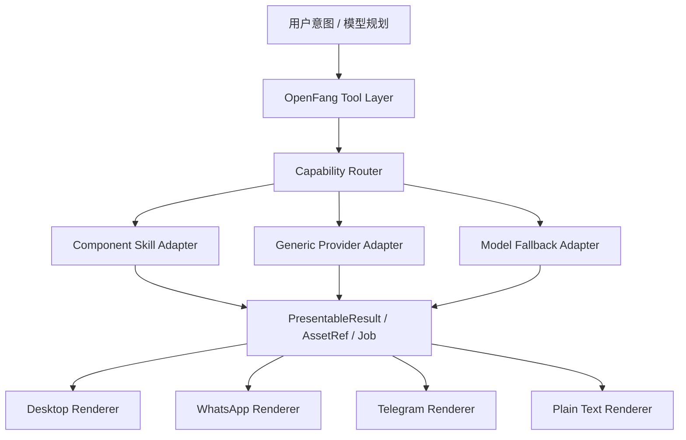

# UI Skill / 组件 Skill / Runtime 工程级重构方案（2026-03-24）

日期：2026-03-24  
状态：Draft v1  
适用范围：`webot-app` 桌面端、`apps/service-rs` 管理层、`vendor/openfang` 运行时、组件中心、渠道绑定输出链路  
当前优先级：高  

---

## 1. 文档目标

本文用于定义 `weBot-app` 下一阶段的工程级重构方案，解决当前 `UI skill`、`组件 skill`、`openfang` 底层工具、桌面端 A2UI 协议、渠道绑定输出之间职责混乱的问题，并为后续扩展以下能力打下统一基础：

1. 图片生成 / 图片修改
2. 视频生成 / 视频编辑
3. 音频生成 / 语音转写 / 媒体理解
4. 文档解析 / 文档摘要 / 文档转换 / 文档比较
5. 多渠道输出（桌面端、WhatsApp、Telegram、QQ、Email 等）
6. 长耗时任务、异步作业与派生资产工作流

本文不是单点修复方案，而是作为未来 2~4 个迭代周期可持续落地的统一架构设计。

---

## 2. 当前设计结论

### 2.1 总体结论

未来系统应明确拆成 4 层：

1. `OpenFang Tool Layer`
   模型优先面向统一语义工具，而不是直接面向组件或 A2UI。
2. `Capability Adapter Layer`
   组件 skill 作为底层工具的能力实现适配器，而不是最终输出协议。
3. `Presentable Result Layer`
   所有工具和组件执行后先返回中立结果对象，不直接输出桌面端 A2UI。
4. `Channel Renderer Layer`
   桌面端、WhatsApp、Telegram 等不同渠道各自把中立结果渲染成目标渠道协议。

### 2.2 核心原则

1. `openfang` 底层工具是稳定主协议层。
2. `UI skill` 只负责桌面端展示规则，不负责能力执行。
3. `组件 skill` 只负责能力接入和参数映射，不再兼任最终展示协议。
4. A2UI 只能存在于桌面端渲染层，不能作为系统通用输出协议。
5. 模型应优先调用统一语义工具，而不是直接构造 `ComponentInvokeAction` 或桌面端 JSON。
6. 图片、视频、音频、文档都必须统一走 `AssetRef + PresentableResult + Job` 三个基础抽象。

---

## 3. 当前代码基线

### 3.1 OpenFang 已有底层工具清单

当前 `vendor/openfang/crates/openfang-runtime/src/tool_runner.rs` 中已内置大量工具，主要包括：

1. 文件与执行：
   - `file_list`
   - `file_read`
   - `file_write`
   - `shell_exec`
   - `apply_patch`
2. 协作与调度：
   - `agent_find`
   - `agent_send`
   - `agent_spawn`
   - `cron_create`
   - `cron_list`
   - `cron_cancel`
   - `channel_send`
3. 媒体与感知：
   - `image_analyze`
   - `media_describe`
   - `media_transcribe`
   - `text_to_speech`
   - `speech_to_text`
4. 图片能力：
   - `image_generate`
   - `image_edit`
   - `my_photo_generate`
   - `my_photo_edit`
5. 浏览器与任务：
   - `browser_*`
   - `process_*`
   - `task_*`
6. 记忆与知识：
   - `memory_recall`
   - `memory_store`
   - `knowledge_*`

当前尚未发现通用 `video_generate` / `video_edit` / `document_parse` 类统一底层工具。

### 3.2 项目中已经实际形成产品链路的底层工具

当前已经明显接入前端与产品流的底层能力主要有：

1. `image_generate`
2. `image_edit`
3. `text_to_speech`
4. `speech_to_text`
5. `media_describe`
6. `agent_send`
7. `cron_*`
8. `file_read / file_list / file_write / shell_exec`

其中最成熟的是图片链路：

1. `openfang` 统一工具已存在
2. runtime 已支持“skill/provider -> 通用服务 -> 模型兜底”分层回退
3. 前端已能根据工具日志把图片结果转成桌面卡片

### 3.3 当前存在的结构性问题

当前体系存在以下核心问题：

1. 模型被注入过多桌面端 A2UI 细节，能力调用与展示协议耦合。
2. `UI skill`、`组件 skill`、统一工具、桌面组件协议职责重叠。
3. 组件直调链路在桌面端能工作，但在渠道绑定场景容易失真。
4. 图片、视频、语音、文档没有统一的资源引用模型。
5. 不同工具返回结果格式不统一，前端通过大量特判解析。
6. 视频、文档、多媒体链路缺少统一的长耗时任务模型。
7. 扩展新能力时，当前做法高度依赖 prompt 规则和前端特判，扩展成本高。

---

## 4. 当前痛点与漏洞分析

### 4.1 模型直接面向 A2UI 导致的系统性问题

当前如果模型直接输出桌面端 A2UI JSON，会带来以下问题：

1. 渠道端无法理解桌面端专属组件协议。
2. 同一条回复同时承担“能力执行”和“最终渲染”两种职责，边界混乱。
3. 模型会把大量精力花在猜组件名、字段名、JSON 结构，而不是稳定调用能力。
4. 组件一旦重命名或参数调整，所有提示词与适配逻辑都会一起抖动。

### 4.2 资源引用模型缺失

当前系统里同时存在：

1. 工作区相对路径
2. 本地绝对路径
3. `/api/uploads/...`
4. `/api/management/agents/...`
5. `http/https`
6. `data:image/...`
7. base64 裸数据

但没有统一的资源抽象，导致：

1. 工具层、组件层、渲染层都在重复做路径解析。
2. 图片问题刚修完，视频、文档、音频未来还会重复踩坑。
3. 资产来源不透明，不利于缓存、权限、渠道转发、派生文件管理。

### 4.3 返回结果模型缺失

当前不同能力返回格式差异较大：

1. 图片工具返回图片 URL 列表
2. TTS 返回音频地址和时长
3. 组件调用返回 `ComponentInvokeResult`
4. 部分能力只回纯文本

前端只能按工具名特判。

这会直接导致：

1. 新增能力时需要继续写专属 fallback 解析。
2. 同一类结果无法统一映射到桌面端和渠道端。
3. 结果协议难以测试、难以稳定演进。

### 4.4 长耗时作业模型缺失

未来以下能力大概率都不是短平快同步请求：

1. 视频生成
2. 视频转音频
3. OCR 与多页文档解析
4. 长音频转写
5. 文档转换
6. 批量媒体处理

目前缺少统一的 `Job` 抽象，会导致每个能力自行发明轮询、进度、取消、失败回调协议。

### 4.5 Prompt 规则膨胀风险

当前 `agent-client.ts` 已承担了大量运行时路由逻辑：

1. 图片路由
2. 自管理行为
3. 组件直调规则
4. 组件参数拼接规则
5. 桌面组件优先级

该模式短期可用，但长期风险很高：

1. 规则难验证
2. 新能力增加后 prompt 继续膨胀
3. 过度依赖模型记忆规则而非结构化元数据
4. 模型升级后行为波动更大

---

## 5. 目标架构

### 5.1 分层架构



### 5.2 各层职责

#### 5.2.1 OpenFang Tool Layer

职责：

1. 作为模型唯一稳定主协议层
2. 提供统一语义工具
3. 屏蔽底层 provider / 组件 / 模型差异

模型未来优先面向以下统一能力：

1. `generate.image`
2. `edit.image`
3. `generate.video`
4. `edit.video`
5. `generate.audio`
6. `transcribe.audio`
7. `analyze.media`
8. `parse.document`
9. `extract.document`
10. `summarize.document`
11. `convert.document`
12. `present.choice`
13. `confirm.action`

#### 5.2.2 Capability Adapter Layer

职责：

1. 接管统一工具的实际执行
2. 将工具语义映射到组件 skill / provider / 模型 fallback
3. 处理参数映射、源素材要求、输入归一化、输出归一化

这里的组件 skill 不再是最终输出协议，而是工具实现插件。

#### 5.2.3 Presentable Result Layer

职责：

1. 统一承接所有能力输出
2. 对上游 provider / 组件差异做归一化
3. 为桌面端和渠道端提供统一渲染输入

这是整个重构中最关键的一层。

#### 5.2.4 Channel Renderer Layer

职责：

1. 桌面端转 A2UI
2. WhatsApp 转文本 + 媒体 + 按钮
3. Telegram 转文本 + Inline Keyboard
4. 纯文本环境降级

该层不能反向影响能力调用。

---

## 6. 统一基础抽象

### 6.1 Capability

能力必须从“工具名散点”升级为“稳定能力键”。

建议定义如下命名规范：

1. `generate.image`
2. `edit.image`
3. `generate.video`
4. `edit.video`
5. `generate.audio`
6. `transcribe.audio`
7. `analyze.media`
8. `parse.document`
9. `extract.document`
10. `summarize.document`
11. `convert.document`
12. `compare.document`
13. `confirm.action`
14. `present.choice`

统一工具只是能力对模型暴露时的名字，内部路由使用 capability key。

### 6.2 AssetRef

所有媒体与文档资源必须统一使用 `AssetRef` 描述，禁止各层直接传裸字符串。

建议结构如下：

```json
{
  "id": "asset_123",
  "kind": "workspace_file",
  "agent_id": "luna",
  "path": "agent_profile/portrait/portrait-001.png",
  "mime_type": "image/png",
  "display_name": "portrait-001.png",
  "origin": "agent_workspace"
}
```

支持的 `kind` 建议至少包括：

1. `workspace_file`
2. `absolute_file`
3. `upload_url`
4. `management_media_url`
5. `remote_url`
6. `data_url`
7. `base64_blob`
8. `derived_asset`

### 6.3 PresentableResult

所有工具和组件输出都必须先归一化成 `PresentableResult`。

建议结构族如下：

1. `TextResult`
2. `MediaResult`
3. `DocumentResult`
4. `ChoiceResult`
5. `ConfirmResult`
6. `TaskResult`
7. `ErrorResult`

示例：

```json
{
  "kind": "media_result",
  "media_type": "video",
  "text": "已生成 1 个视频",
  "items": [
    {
      "asset": {
        "kind": "upload_url",
        "url": "/api/uploads/abc.mp4",
        "mime_type": "video/mp4"
      },
      "poster_asset": {
        "kind": "upload_url",
        "url": "/api/uploads/poster.jpg",
        "mime_type": "image/jpeg"
      }
    }
  ],
  "meta": {
    "tool": "video_generate",
    "provider": "component_skill",
    "component_name": "image2video"
  }
}
```

### 6.4 Job

视频、文档、长音频、多媒体链路统一采用 `Job` 模型。

建议结构如下：

```json
{
  "job_id": "job_001",
  "capability": "generate.video",
  "status": "queued",
  "progress": 0,
  "message": "任务已排队",
  "result": null
}
```

状态建议统一为：

1. `queued`
2. `running`
3. `done`
4. `failed`
5. `cancelled`

---

## 7. UI Skill 设计

### 7.1 UI Skill 的最终定位

`UI skill` 只负责桌面端视觉呈现策略，不负责能力执行。

它要解决的是：

1. 同一类 `PresentableResult` 在桌面端如何映射到 A2UI
2. 图片显示用什么卡片
3. 视频显示用什么卡片
4. 选项与确认如何显示
5. 文档预览如何显示

### 7.2 UI Skill 禁止承担的职责

1. 不直接决定调用哪个组件 skill
2. 不直接决定调用哪个 provider
3. 不直接要求模型输出最终组件 JSON 作为主协议
4. 不包含渠道端输出规则

### 7.3 UI Skill 推荐输出规则

桌面端建议建立以下映射：

1. `MediaResult(image)` -> `ImageCover` / `ImageCarousel`
2. `MediaResult(video)` -> `VideoCover` / `VideoGallery`
3. `MediaResult(audio)` -> `AudioPlayer` / `AudioPlaylist`
4. `DocumentResult(pdf/docx/xlsx/pptx)` -> `OfficePreviewCard`
5. `TextResult(markdown)` -> `MarkdownPreviewCard`
6. `ChoiceResult` -> `OptionSelector`
7. `ConfirmResult` -> 通用确认卡
8. 长耗时 `Job` -> 任务进度卡

---

## 8. 组件 Skill 设计

### 8.1 组件 Skill 的最终定位

组件 skill 是能力实现适配器，不是最终协议。

每个组件 skill 应声明：

1. 它接管哪些 capability
2. 它需要哪些真实源素材
3. 哪些参数是描述型参数
4. 输出属于哪种 `PresentableResult`
5. 桌面端是否有专属渲染组件

### 8.2 组件 Skill Manifest 建议

建议新增统一 manifest 字段：

```json
{
  "skill_type": "component_adapter",
  "capabilities": ["generate.video"],
  "input_contract": {
    "required_params": ["image", "prompt"],
    "strict_source_params": ["image"],
    "descriptive_params": ["prompt"]
  },
  "output_contract": {
    "result_kind": "media_result",
    "media_type": "video"
  },
  "desktop_render": {
    "preferred_card": "ComfyUIVideoCard"
  }
}
```

### 8.3 组件 Skill 分类

建议把组件 skill 分为两类：

1. `tool_adapter`
   供统一工具层调用
2. `desktop_widget`
   仅供桌面端显示和手动交互

两者可在同一个 skill 中共存，但必须明确分区。

### 8.4 组件 Skill 直调规则

未来只允许以下两种场景直调组件：

1. 用户明确指定某个组件
2. 当前是桌面端且用户需要直接打开组件交互卡片

除此之外，统一工具优先。

---

## 9. 渠道渲染设计

### 9.1 渠道无关交互模型

所有交互必须先语义化，再桌面化 / 渠道化。

例如：

1. `ChoiceResult`
2. `ConfirmResult`
3. `TaskResult`

渠道侧不能直接消费桌面组件协议。

### 9.2 Desktop Renderer

输入：`PresentableResult`  
输出：A2UI / 内部 UI Spec

### 9.3 WhatsApp Renderer

输入：`PresentableResult`  
输出建议：

1. 文本
2. 图片 / 视频 / 音频附件
3. 轻量按钮或“回复数字”交互
4. 文档链接与摘要

### 9.4 Telegram Renderer

输入：`PresentableResult`  
输出建议：

1. 文本
2. 媒体
3. Inline Keyboard
4. 文件附件

### 9.5 Plain Text Renderer

作为最终兜底：

1. 仅输出文本摘要
2. 附资源 URL
3. 交互降级成编号选项或确认文字

---

## 10. 新增能力扩展规划

### 10.1 视频能力族

建议新增统一工具：

1. `video_generate`
2. `video_edit`
3. `media_thumbnail`
4. `media_extract_audio`
5. `media_extract_frames`
6. `media_subtitle_generate`
7. `media_subtitle_burn`
8. `media_trim`

`video_generate` 推荐路由：

1. `generate.video` capability router
2. 优先命中 `image2video` / `text2video` 组件 skill
3. 再走通用视频 provider
4. 最后模型能力兜底

### 10.2 文档能力族

建议新增统一工具：

1. `document_parse`
2. `document_extract`
3. `document_summarize`
4. `document_convert`
5. `document_compare`
6. `document_chunk`
7. `document_preview`

### 10.3 媒体工作流能力族

建议新增统一工具：

1. `media_convert`
2. `media_merge`
3. `media_split`
4. `media_package`

这些能力未来都应回到：

1. 统一工具
2. 统一输入 `AssetRef`
3. 统一输出 `PresentableResult`
4. 长耗时任务统一走 `Job`

---

## 11. 关键注册中心设计

### 11.1 Capability Registry

目标：解耦“工具名 -> 组件名 -> provider 名”的硬编码关系。

建议每个 capability 注册多个 provider：

```json
{
  "capability": "generate.video",
  "providers": [
    {
      "type": "component_skill",
      "name": "image2video",
      "priority": 100,
      "requirements": ["image"]
    },
    {
      "type": "component_skill",
      "name": "text2video",
      "priority": 90,
      "requirements": ["prompt"]
    },
    {
      "type": "model_fallback",
      "name": "native_video_model",
      "priority": 10
    }
  ]
}
```

### 11.2 Renderer Registry

目标：解耦“工具名特判 -> 桌面卡片名”的硬编码关系。

建议按结果类型注册：

1. `media_result(image)` -> 桌面/渠道渲染器
2. `media_result(video)` -> 桌面/渠道渲染器
3. `document_result(pdf)` -> 桌面/渠道渲染器
4. `choice_result` -> 桌面/渠道渲染器
5. `confirm_result` -> 桌面/渠道渲染器

### 11.3 Source Resolver

目标：统一解析资源来源。

职责：

1. 识别 `AssetRef`
2. 解析工作区路径
3. 下载远程资源
4. 识别 MIME
5. 上传到 ComfyUI / provider
6. 处理缓存与权限

这是未来所有媒体与文档能力的底层基础设施。

---

## 12. 模块级改造建议

### 12.1 `vendor/openfang`

建议新增或升级：

1. 新增 capability router
2. 新增 `video_generate` / `video_edit`
3. 新增 `document_*` 工具族
4. 引入 `AssetRef` 与 `PresentableResult`
5. 引入 `Job` 与异步任务统一返回
6. 底层工具描述改成“能力语义优先”，减少组件名暴露

### 12.2 `apps/service-rs`

建议新增或升级：

1. `Capability Registry`
2. `Renderer Registry`
3. `Source Resolver`
4. 组件中心从“定义存储”升级为“组件能力注册中心”
5. 统一 `PresentableResult` 与 `Job` API
6. 渠道端渲染器适配

### 12.3 `apps/frontend`

建议新增或升级：

1. 将基于工具名的 fallback 渲染逐步改为基于 `PresentableResult.kind`
2. 保留 A2UI，但只作为桌面 renderer 输出协议
3. 将 `ComponentInvokeAction` 降级为桌面专用能力
4. 增加桌面端结果卡片适配器，而不是模型直接写卡片
5. 聊天层增加 `Job` 进度渲染

---

## 13. 迁移路线

### Phase 1：收敛基础抽象

目标：

1. 定义 `Capability`
2. 定义 `AssetRef`
3. 定义 `PresentableResult`
4. 定义 `Job`

产出：

1. TS 类型
2. Rust 类型
3. API schema
4. 基础测试

### Phase 2：先改图片链路

目标：

1. 保留 `image_generate / image_edit`
2. 将其输出升级到 `PresentableResult`
3. 前端桌面端改为基于结果类型渲染

意义：

图片链路最成熟，适合作为整套重构试点。

### Phase 3：新增视频统一工具

目标：

1. 新增 `video_generate`
2. 接入 `Capability Registry`
3. 让 `image2video` / `text2video` 组件 skill 成为底层 provider
4. 输出统一 `MediaResult(video)`

### Phase 4：渠道渲染层落地

目标：

1. 桌面 renderer 与 WhatsApp renderer 拆分
2. 桌面继续输出 A2UI
3. 渠道端只消费中立结果

### Phase 5：文档能力族上线

目标：

1. `document_parse`
2. `document_extract`
3. `document_summarize`
4. `document_convert`

### Phase 6：媒体工作流与长任务统一

目标：

1. `media_*` 工作流工具族
2. 统一异步 job 管理
3. 派生资产关系与缓存

---

## 14. 测试策略

### 14.1 路由测试

必须覆盖：

1. 有源图 + 生成视频 -> 命中 `image2video`
2. 纯描述 + 生成视频 -> 命中 `text2video`
3. 改图请求 -> 命中 `image_edit`
4. 没有源图但要求改图 -> 正确报错，不得偷切 `image_generate`
5. 文档能力按 MIME / 扩展名正确路由

### 14.2 Source Resolver 测试

必须覆盖：

1. 工作区相对路径
2. 本地绝对路径
3. `/api/uploads/...`
4. `/api/management/agents/...`
5. `http/https`
6. `data:image/...`

### 14.3 Result Renderer 测试

同一个 `PresentableResult` 必须覆盖：

1. Desktop Renderer 输出
2. WhatsApp Renderer 输出
3. Telegram Renderer 输出
4. Plain Text Renderer 输出

### 14.4 Job 测试

必须覆盖：

1. 排队
2. 运行中
3. 成功
4. 失败
5. 取消
6. 进度更新

---

## 15. 风险与控制措施

### 15.1 风险：迁移期双协议并存

控制：

1. 先保留旧链路
2. 图片能力先试点
3. 逐步将旧组件直调迁移到统一工具

### 15.2 风险：Prompt 与结构化路由冲突

控制：

1. Prompt 逐步减负
2. 路由逻辑尽量下沉到 `Capability Registry`
3. Prompt 只保留原则，不保留过多组件细节

### 15.3 风险：渠道能力差异大

控制：

1. 所有交互先语义化
2. renderer 层决定降级方式
3. 不让模型直接输出渠道专有协议

### 15.4 风险：视频与文档链路复杂度高

控制：

1. 统一走 `Job`
2. 统一走 `AssetRef`
3. 统一走 `PresentableResult`

---

## 16. 本期建议落地优先级

建议按以下优先级推进：

1. 抽出 `AssetRef`
2. 抽出 `PresentableResult`
3. 抽出 `Job`
4. 在 `openfang` 中新增 `Capability Router`
5. 重构图片链路为标准范式
6. 新增 `video_generate`
7. 将组件 skill 降级为 capability provider
8. 将 `UI skill` 收敛为桌面端 renderer 规则
9. 为 WhatsApp / Telegram 增加 renderer
10. 新增文档能力族

---

## 17. 最终结论

本次重构的本质不是“继续补规则”，而是把系统从“模型直面 UI 协议 + 组件名”升级为“模型直面统一能力 + 系统内部自行选择 provider + 渠道自行渲染结果”。

如果该方案落地，项目将获得以下长期收益：

1. 底层工具更稳定，可复用性更高
2. 组件 skill 不再污染跨渠道输出协议
3. 桌面端 A2UI 得到保留，但不会反向绑架所有渠道
4. 图片、视频、音频、文档能力具备统一扩展路径
5. 新增 provider、新增组件、新增渠道时不再需要继续膨胀 prompt 规则
6. 后续引入 OCR、字幕、文档解析、媒体派生处理会更加自然

一句话总结：

**能力统一进底层工具，组件统一做能力适配，结果统一进中立模型，桌面和渠道统一走各自 renderer。**

